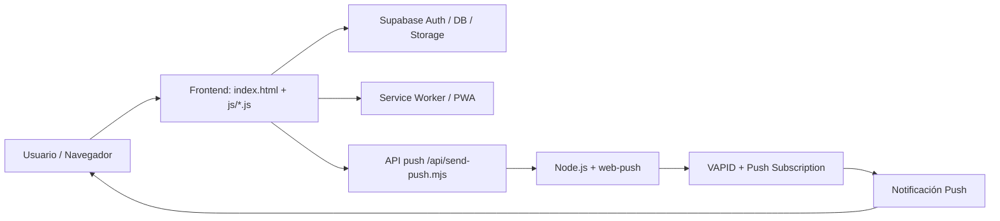

# LUMEN — Documentación completa del proyecto

## 1. Descripción general

LUMEN es una aplicación web comunitaria, espiritual y formativa orientada a la juventud y la vida eclesial. Está diseñada como una PWA (Progressive Web App), con navegación tipo app, contenido catequético, devocional, comunidad, gestión de eventos y un sistema de notificaciones push.

La idea central es ofrecer una experiencia digital cercana, útil y pastoral: un espacio para la oración, la formación, la participación y la comunicación dentro de la comunidad.

---

## 2. Objetivo del proyecto

LUMEN busca:

- acompañar espiritualmente a la comunidad
- facilitar formación y catequesis
- centralizar actividades y avisos
- ofrecer un espacio de oración y reflexión
- fortalecer la comunidad mediante intenciones, encuestas y contenido
- enviar notificaciones relevantes en tiempo real
- funcionar como app instalada desde navegador

---

## 3. Tecnologías utilizadas

- HTML5
- CSS3
- JavaScript vanilla
- Node.js
- Supabase
- Service Worker
- Web Push / VAPID
- Vercel / serverless functions

---

## 4. Arquitectura general



### Frontend
- HTML + CSS + JavaScript
- navegación por vistas
- arquitectura modular por archivos JS
- diseño mobile-first y adaptado a app

### Backend / servicios
- autenticación y perfiles con Supabase
- almacenamiento y datos relacionales
- API de envío de push con Node.js
- notificaciones usando VAPID y Web Push

### PWA
- manifest.json
- sw.js
- instalación desde navegador
- funcionamiento como app nativa en móvil/desktop

---

## 5. Estructura del proyecto

```text
LUMEN/
├── api/
│   ├── send-push.mjs
│   └── _lib/
│       └── push.js
├── assets/
│   └── icons/
├── css/
│   └── styles.css
├── js/
│   ├── app.js
│   ├── auth.js
│   ├── data.js
│   ├── devocional_data.js
│   ├── examen_data.js
│   ├── formacion_data.js
│   ├── frases_santos.js
│   ├── icons.js
│   ├── novenas_data.js
│   ├── oraciones_data.js
│   ├── push.js
│   ├── rosario_data.js
│   ├── santoral.js
│   ├── supabase.js
│   ├── ui.js
│   └── views/
│       ├── actividades.js
│       ├── blog.js
│       ├── contacto.js
│       ├── detalle.js
│       ├── devocional.js
│       ├── encuestas.js
│       ├── examen.js
│       ├── favoritos.js
│       ├── formacion.js
│       ├── gestion.js
│       ├── inicio.js
│       ├── intenciones.js
│       ├── landing.js
│       ├── nosotros.js
│       ├── notificaciones.js
│       ├── novenas.js
│       ├── oraciones.js
│       ├── perfil.js
│       ├── recursos.js
│       ├── rosario.js
│       └── ...
├── scripts/
│   └── local-server.mjs
├── sql/
│   ├── schema.sql
│   ├── storage.sql
│   ├── migracion_*.sql
├── supabase/
│   └── functions/
├── index.html
├── manifest.json
├── package.json
├── README.md
├── sw.js
├── vercel.json
└── .env.example
```

---

## 6. Archivo principal: index.html

El archivo `index.html` es el punto de entrada de la app. Aquí se cargan estilos, fuentes, iconos, PWA manifest y la estructura general de la interfaz.

### Ejemplo de estructura principal

```html
<!DOCTYPE html>
<html lang="es">
<head>
    <meta charset="UTF-8">
    <meta name="viewport" content="width=device-width, initial-scale=1.0">
    <title>LUMEN</title>
    <link rel="manifest" href="manifest.json">
    <meta name="theme-color" content="#005F8A">
    <link rel="stylesheet" href="css/styles.css">
</head>
<body>
    <header class="navbar">
        <div class="logo">LUMEN</div>
    </header>
    <main id="app-container"></main>
    <script src="js/app.js"></script>
</body>
</html>
```

### Qué hace
- inicializa interfaz general
- carga la navegación
- define menú, drawer y modales
- prepara la app para PWA y push

---

## 7. Archivo base: js/app.js

Este archivo es el núcleo del frontend. Define el enrutamiento entre vistas, gestiona transiciones, inicializa el service worker y prepara la app.

### Código principal

```js
const LumenRouter = {
    currentView: 'landing',
    _activeView: null,
    navigateTo: function(viewName, skipTransition) {
        this.currentView = viewName;
        const container = document.getElementById('app-container');
        let viewObj;
        let title = "LUMEN";

        switch(viewName) {
            case 'landing': viewObj = typeof LandingView !== 'undefined' ? LandingView : null; title = "Inicio"; break;
            case 'inicio': viewObj = typeof InicioView !== 'undefined' ? InicioView : null; title = "Dashboard"; break;
            case 'nosotros': viewObj = typeof NosotrosView !== 'undefined' ? NosotrosView : null; title = "Nosotros"; break;
            case 'actividades': viewObj = typeof ActividadesView !== 'undefined' ? ActividadesView : null; title = "Actividades"; break;
            case 'devocional': viewObj = typeof DevocionalView !== 'undefined' ? DevocionalView : null; title = "Devocional"; break;
            case 'formacion': viewObj = typeof FormacionView !== 'undefined' ? FormacionView : null; title = "Formación"; break;
            case 'oraciones': viewObj = typeof OracionesView !== 'undefined' ? OracionesView : null; title = "Oraciones"; break;
            case 'rosario': viewObj = typeof RosarioView !== 'undefined' ? RosarioView : null; title = "Rosario"; break;
            case 'novenas': viewObj = typeof NovenasView !== 'undefined' ? NovenasView : null; title = "Novenas"; break;
            case 'examen': viewObj = typeof ExamenView !== 'undefined' ? ExamenView : null; title = "Examen de Conciencia"; break;
            case 'intenciones': viewObj = typeof IntencionesView !== 'undefined' ? IntencionesView : null; title = "Intenciones"; break;
            case 'encuestas': viewObj = typeof EncuestasView !== 'undefined' ? EncuestasView : null; title = "Encuestas"; break;
            case 'gestion': viewObj = typeof GestionView !== 'undefined' ? GestionView : null; title = "Gestión"; break;
            case 'contacto': viewObj = typeof ContactoView !== 'undefined' ? ContactoView : null; title = "Contacto"; break;
            default: viewObj = typeof LandingView !== 'undefined' ? LandingView : null;
        }

        document.title = `LUMEN | ${title}`;

        if (!viewObj || !viewObj.render) {
            container.innerHTML = `<div class="state-container"><h3>Error de carga</h3><p>La vista no se encontró.</p></div>`;
            return;
        }

        const renderView = () => {
            if (this._activeView && typeof this._activeView.destroy === 'function') this._activeView.destroy();
            this._activeView = viewObj;
            container.innerHTML = viewObj.render();
            if (viewObj.init) viewObj.init();
        };

        renderView();
    }
};
```

### Qué hace
- dirige la navegación por secciones
- renderiza las vistas dinámicamente
- activa animaciones y transiciones
- mantiene comportamiento tipo app

---

## 8. Autenticación: js/auth.js

Este archivo gestiona la autenticación con Supabase y el estado del usuario actual.

### Código principal

```js
supabase.auth.onAuthStateChange((event, session) => {
    if (session?.user) {
        LumenAuth.currentUser = session.user;
        LumenAuth.userProfile = null;
    } else {
        LumenAuth.currentUser = null;
        LumenAuth.userProfile = null;
    }
});

async function login(email, password) {
    return supabase.auth.signInWithPassword({ email, password });
}

async function signUp(email, password) {
    return supabase.auth.signUp({ email, password });
}
```

### Funcionalidad
- login / registro
- recuperación de contraseña
- observación del estado de sesión
- control de permisos por usuario
- manejo de perfiles y roles

---

## 9. Configuración de Supabase: js/supabase.js

```js
const supabaseConfig = {
  url: "https://etioxnigysbxitiaveyp.supabase.co",
  anonKey: "sb_publishable_xFF1aAt7CLjDXtFdJLabLw_7XghDzgY",
  pushEndpoint: "https://lumenve.vercel.app/api/send-push",
  pushVapidKey: "BMCdeUXKlzY4kgk4ULo7DKhdn7GlY1W1mEPyu24juywyaqv94NHA-csWPdpdVZDHB8ag10g-ML7B8_TGX0KzCHk"
};

supabase = window.supabase.createClient(supabaseConfig.url, supabaseConfig.anonKey);
```

### Qué hace
- conecta la app con Supabase
- diseña la base de configuración del proyecto
- prepara endpoint para push
- carga la clave pública VAPID

---

## 10. Sistema de notificaciones push

### js/push.js

Este archivo administra la suscripción push del navegador y la activación de notificaciones.

```js
const LumenPush = {
    async activar() {
        if (!('Notification' in window)) {
            LumenUI.showToast('Tu navegador no soporta notificaciones push.', 'error');
            return;
        }

        const permission = await Notification.requestPermission();
        if (permission !== 'granted') {
            LumenUI.showToast('Debes permitir las notificaciones para recibir avisos.', 'warning');
            return;
        }

        const registration = await navigator.serviceWorker.ready;
        const subscription = await registration.pushManager.subscribe({
            userVisibleOnly: true,
            applicationServerKey: supabaseConfig.pushVapidKey
        });

        await supabase.from('push_subscriptions').upsert({
            endpoint: subscription.endpoint,
            keys: subscription.toJSON().keys,
            user_id: LumenAuth.currentUser.id
        });
    }
};
```

### Qué hace
- pide permisos al usuario
- crea la suscripción push
- guarda la suscripción en Supabase
- prepara el canal para enviar avisos

---

## 11. API de envío de push: api/send-push.mjs

Este es el backend principal para enviar notificaciones push.

```js
import {
  config,
  getUser,
  getProfile,
  runCron,
  sendAll,
  sendSelf,
  markSwReceived,
} from "./_lib/push.js";

export default async function handler(req, res) {
  if (req.method === "OPTIONS") {
    res.setHeader("Access-Control-Allow-Origin", "*");
    res.statusCode = 204;
    return res.end();
  }

  if (req.method !== "POST") return done(res, { error: "Método no permitido" }, 405);

  try {
    const body = await readBody(req);
    const mode = body.mode;

    if (mode === "cron") {
      const secret = req.headers["x-cron-secret"] || "";
      if (!secret || secret !== config.CRON_SECRET) return done(res, { error: "No autorizado" }, 401);
      return done(res, await runCron());
    }

    if (mode === "sw-received") {
      await markSwReceived(body.pingId, body.ok, body.ua);
      return done(res, { ok: true });
    }

    const token = String(req.headers["authorization"] || "").replace(/^Bearer\s+/i, "");
    if (!token) return done(res, { error: "Se requiere sesión" }, 401);

    const user = await getUser(token);
    const profile = await getProfile(user.id);

    if (mode === "self") return done(res, await sendSelf(user.id, payload));
    if (mode === "all") {
      if (profile.role !== "admin") return done(res, { error: "Solo coordinadores" }, 403);
      return done(res, await sendAll(payload, body.avisoId));
    }
  } catch (e) {
    console.error("[send-push]", e);
  }
}
```

### Qué hace
- recibe peticiones POST para avisos
- diferencia entre cron, push propio y envío general
- valida sesión y permisos
- envía notificaciones a usuarios o a todos

---

## 12. Service Worker: sw.js

El service worker es clave para que la app funcione como PWA y para mostrar notificaciones entrantes.

```js
self.addEventListener("push", (event) => {
  let data = { title: "LUMEN", body: "", url: "/" };
  try {
    if (event.data) {
      const parsed = event.data.json();
      if (parsed && typeof parsed === "object") data = Object.assign({}, data, parsed);
    }
  } catch (e) {
    if (event.data) data.body = event.data.text();
  }

  const notify = () =>
    self.registration.showNotification(data.title, {
      body: data.body,
      icon: "/assets/icons/icon-192.png",
      badge: "/assets/icons/icon-192.png",
      data: { url: data.url },
      tag: "lumen-notif",
      renotify: true
    });

  event.waitUntil(notify());
});
```

### Función del sw.js
- cachea recursos para velocidad/offline
- registra la app como PWA
- recibe push del servidor
- muestra notificaciones en segundo plano
- al hacer clic, abre la URL correspondiente

---

## 13. Módulos de contenido y espiritualidad

Los archivos JS con sufijo `_data` contienen la base del contenido del proyecto.

### Archivos clave

- `devocional_data.js`: pasajes, reflexiones y contenido del día
- `formacion_data.js`: materiales catequéticos y educativos
- `oraciones_data.js`: plegarias y textos espirituales
- `rosario_data.js`: misterios y estructura del rosario
- `novenas_data.js`: contenido de novenas
- `examen_data.js`: temas para examen de conciencia
- `santoral.js`: fiestas y referencias del santoral
- `frases_santos.js`: citas espirituales

Estos archivos permiten que la app entregue contenido relevante y personalizado para la vida espiritual dei usuario.

---

## 14. Vistas del proyecto

La app se organiza en vistas separadas por responsabilidad. Algunos ejemplos:

- `landing.js`: presentación inicial
- `inicio.js`: dashboard principal
- `nosotros.js`: identidad y misión
- `actividades.js`: listados de eventos
- `devocional.js`: contenido espiritual del día
- `formacion.js`: formación y catequesis
- `oraciones.js`: rezos y plegarias
- `rosario.js`: rezo interactivo
- `novenas.js`: novenas
- `examen.js`: examen de conciencia
- `intenciones.js`: muro de peticiones
- `encuestas.js`: votaciones y opiniones
- `blog.js`: publicaciones y contenido
- `gestion.js`: administración del contenido
- `perfil.js`: datos del usuario
- `contacto.js`: contacto con la comunidad

Cada vista tiene una estructura de render y init para incorporar dinámicamente contenido y eventos.

---

## 15. Flujo de uso del usuario

1. El usuario entra a la app desde el navegador.
2. La app carga el shell y la vista principal.
3. Puede navegar por contenido espiritual, comunidad y actividades.
4. Si accede con sesión, puede participar en intenciones, encuestas o gestión.
5. Si habilita permisos, recibe avisos push.
6. El backend envía mensajes desde Supabase / API / Web Push.
7. El service worker despliega la notificación y abre la URL asignada.

---

## 16. Variables de entorno y seguridad

Para correr el sistema correctamente, es necesario configurar variables de entorno para:

- servidor local
- conexión con Supabase
- VAPID para notificaciones push
- secreto para cron

Ejemplo:

```env
PORT=8787
SUPABASE_URL=tu_url_supabase
SUPABASE_ANON_KEY=tu_anon_key
SUPABASE_SERVICE_ROLE_KEY=tu_service_role_key
VAPID_PUBLIC_KEY=tu_clave_publica_vapid
VAPID_PRIVATE_KEY=tu_clave_privada_vapid
CRON_SECRET=tu_secreto
```

Esto es esencial para que no se expongan credenciales o secretos en el repositorio.

---

## 17. Cómo ejecutar el proyecto

### Instalar dependencias

```bash
npm install
```

### Ejecutar localmente

```bash
npm run dev
```

### Puerto por defecto

```bash
http://localhost:8787/api/send-push
```

---

## 18. Despliegue

El proyecto está preparado para desplegarse en Vercel, aprovechando:

- Vercel serverless functions
- API de push
- PWA y service worker
- Supabase como base de datos y auth

---

## 19. Reflexión final

LUMEN es un proyecto de gran valor porque combina:

- espiritualidad
- tecnología
- comunidad
- experiencia móvil
- comunicación inmediata

No es solo una web. Es una herramienta de acompañamiento y evangelización digital. Su valor radica en crear un ecosistema donde la fe, la educación y la comunidad pueden convivir en una experiencia moderna y útil.

---

## 20. Resumen corto

En pocas palabras, LUMEN es una web app espiritual y comunitaria que:

- ofrece formación y recursos devocionales
- conecta a la comunidad
- organiza actividades y avisos
- permite notificaciones push
- funciona como aplicación instalada
- usa Supabase como base de datos y autenticación

---

## 21. Frase final

“LUMEN no es solo una app; es un espacio de luz, acompañamiento y comunidad.”
