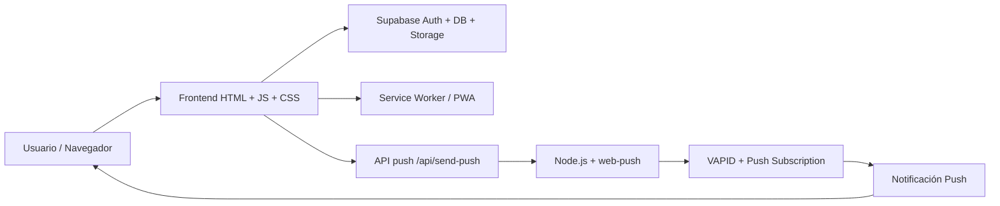

# LUMEN

<div align="center">
  
  
  
  
  
</div>


> “Iluminando el camino.”

LUMEN es una plataforma web comunitaria, espiritual y formativa pensada para acompañar a la juventud y a la comunidad eclesial en su proceso de fe, formación y participación. Con una experiencia moderna tipo app, combina contenido devocional, catequesis, comunidad, avisos y notificaciones push para mantener viva la conexión espiritual y pastoral.

Es más que una página web: es un espacio de acompañamiento digital para la vida de la parroquia, la comunidad juvenil y la misión evangelizadora.

---

## ✨ ¿Qué hace LUMEN?

LUMEN reúne en una sola experiencia digital una serie de elementos clave para la vida comunitaria y espiritual:

- formación catequética y doctrinal
- devocionales y reflexión diaria
- oraciones, rosario y novenas
- examen de conciencia y espiritualidad práctica
- actividades, eventos y comunidad
- muro de intenciones y encuestas rápidas
- sistema de avisos y notificaciones push
- experiencia PWA para instalar la app en móvil o escritorio

---

## 🌟 Características principales

### Comunidad y espiritualidad
- Devocional del día
- Rosario interactivo
- Novenas
- Oraciones católicas y textos espirituales
- Examen de conciencia guiado
- Santo del día y referencias patrísticas

### Participación y vida parroquial
- Muro de intenciones
- Encuestas comunitarias
- Blog y publicaciones
- Gestión de eventos y actividades
- Perfiles de usuarios
- Panel de administración para moderación de contenido

### Experiencia moderna
- Diseño visual contemplativo y claro
- Navegación estilo app
- PWA con instalación desde navegador
- Notificaciones push para mensajes y avisos
- Rendimiento optimizado para dispositivos móviles

---

## 🏗️ Arquitectura del sistema



### Frontend
- HTML5 + CSS3 + JavaScript vanilla
- SPA con navegación por vistas
- páginas modulares dentro de `js/views/`
- enfoque mobile-first y UX pastoral

### Backend y datos
- Supabase para autenticación, perfiles y contenido
- almacenamiento para archivos y recursos
- gestión de registros de usuarios, eventos e intenciones

### Notificaciones push
- `sw.js` para recibir y mostrar avisos
- `api/send-push.mjs` como endpoint central
- `web-push` + VAPID para autenticación segura

---

## 📁 Estructura del proyecto

```text
LUMEN/
├── api/
│   ├── send-push.mjs
│   └── _lib/
│       └── push.js
├── assets/
│   └── icons/
├── css/
│   └── styles.css
├── js/
│   ├── app.js
│   ├── auth.js
│   ├── data.js
│   ├── devocional_data.js
│   ├── examen_data.js
│   ├── formacion_data.js
│   ├── frases_santos.js
│   ├── icons.js
│   ├── novenas_data.js
│   ├── oraciones_data.js
│   ├── push.js
│   ├── rosario_data.js
│   ├── santoral.js
│   ├── supabase.js
│   ├── ui.js
│   └── views/
│       ├── actividades.js
│       ├── blog.js
│       ├── contacto.js
│       ├── detalle.js
│       ├── devocional.js
│       ├── encuestas.js
│       ├── examen.js
│       ├── favoritos.js
│       ├── formacion.js
│       ├── gestion.js
│       ├── inicio.js
│       ├── intenciones.js
│       ├── landing.js
│       ├── nosotros.js
│       ├── notificaciones.js
│       ├── novenas.js
│       ├── oraciones.js
│       ├── perfil.js
│       ├── recursos.js
│       ├── rosario.js
│       └── ...
├── scripts/
│   └── local-server.mjs
├── sql/
│   ├── schema.sql
│   ├── storage.sql
│   └── migracion_*.sql
├── supabase/
│   └── functions/
├── index.html
├── manifest.json
├── package.json
├── README.md
├── sw.js
├── vercel.json
└── .env.example
```

---

## 🚀 Inicio rápido

### Requisitos

- Node.js 18+
- npm
- acceso a Supabase
- claves VAPID activas si deseas probar notificaciones reales

### Instalar dependencias

```bash
npm install
```

### Ejecutar la app localmente

```bash
npm run dev
```

El proyecto levanta el servidor local de la API de push y deja disponible el endpoint de pruebas.

### Endpoint local

```bash
http://localhost:8787/api/send-push
```

---

## 🔐 Variables de entorno

Crea un archivo `.env` en la raíz del proyecto con algo similar a esto:

```env
PORT=8787

SUPABASE_URL=tu_url_supabase
SUPABASE_ANON_KEY=tu_anon_key
SUPABASE_SERVICE_ROLE_KEY=tu_service_role_key

VAPID_PUBLIC_KEY=tu_vapid_public_key
VAPID_PRIVATE_KEY=tu_vapid_private_key
CRON_SECRET=tu_secreto_de_cron
```

> Nunca compartas tus secretos en el repositorio. Usa variables de entorno reales en local o en despliegue.

---

## 🧩 Módulos principales

- `js/app.js`: shell principal y navegación
- `js/auth.js`: autenticación y permisos
- `js/data.js`: consultas de contenido y comunidad
- `js/push.js`: suscripción y lógica de notificaciones push
- `js/ui.js`: comportamiento visual y UX
- `js/views/*.js`: cada vista del producto
- `api/send-push.mjs`: endpoint de envío de mensajes push
- `sw.js`: service worker para recibir notificaciones y caché

---

## 📡 Flujo de notificaciones push

1. El usuario activa avisos desde la app.
2. El navegador genera una suscripción push.
3. La suscripción se guarda en Supabase.
4. El backend valida la identidad con VAPID.
5. El servidor envía el mensaje.
6. El service worker muestra la notificación.
7. Al clickar, abre la vista o URL correspondiente.

Esto hace que la comunidad pueda recibir avisos importantes sin depender de una app nativa convencional.

---

## 🌍 Despliegue

El proyecto está preparado para desplegarse en Vercel o cualquier entorno compatible con Node.js y serverless functions.

### Elementos clave del despliegue

- `vercel.json` para la configuración del deploy
- `api/send-push.mjs` como endpoint serverless
- `manifest.json` para la identidad PWA
- `sw.js` para caché y notificaciones

---

## 🧠 Filosofía del proyecto

LUMEN no es solo una herramienta técnica. Tiene una intención pastoral y comunitaria:

- acercar la fe a la realidad cotidiana
- crear comunidad desde la presencia digital
- apoyar la oración, la reflexión y la catequesis
- facilitar la difusión de actividades y ayudas espirituales
- mantener al grupo unido con una experiencia clara, seria y acogedora

---

## 🛠️ Stack tecnológico

- JavaScript
- HTML5
- CSS3
- Node.js
- Supabase
- Service Worker
- Web Push / VAPID
- Vercel

---

## 🤝 Contribución

Si quieres colaborar:

1. haz fork del repositorio
2. crea una rama con un nombre claro
3. implementa tus cambios con criterio técnico y pastoral
4. prueba en local
5. envía tu pull request con una descripción concreta

---

## 📌 Estado del proyecto

LUMEN es una plataforma viva, con una base sólida para crecer en contenidos, comunidad, gestión y experiencia digital. Tiene una estructura lista para evolucionar con nuevas funciones, módulos y mejoras de producto.

---

## 💡 Frase del proyecto

“Iluminando el camino, fortaleciendo la comunidad y acompañando la fe.”

---

## ¿Quieres una versión aún más especial?

Puedo dejarte también una de estas tres variantes:

- una versión más premium y visual, estilo landing/portfolio
- un README ultra limpio para GitHub con banner hero y badges más impactantes
- una documentación técnica más profunda con diagramas, flujo de backend/frontend y guías de implementación
